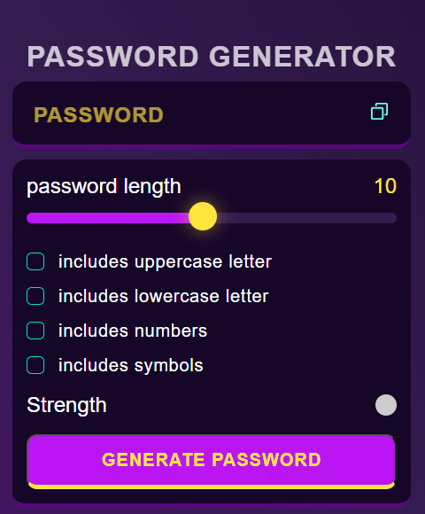
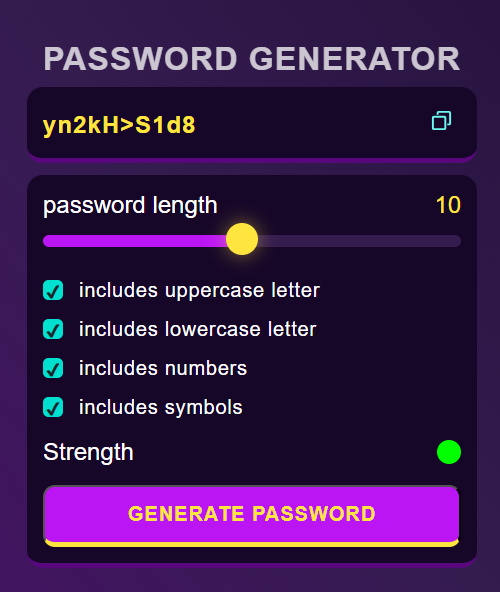

# 🔐 Password Generator App

A simple and responsive password generator built with HTML, CSS, and JavaScript.

## 💡 Features
- Choose password length
- Include uppercase, lowercase, numbers, and special characters
- Copy password to clipboard

## 🛠️ Technologies Used
- HTML
- CSS
- JavaScript

## 🚀 How to Use
1. Select your desired options.
2. Click **Generate Password**.
3. Click the copy icon to use the password anywhere.

## 📷 Screenshot

## 👨‍💻 Author
**Surendra Pratap Mishra**

